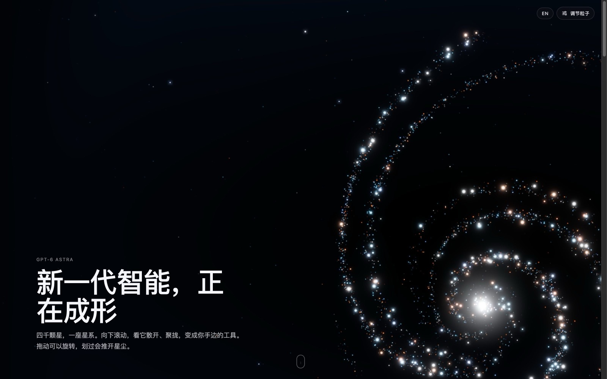
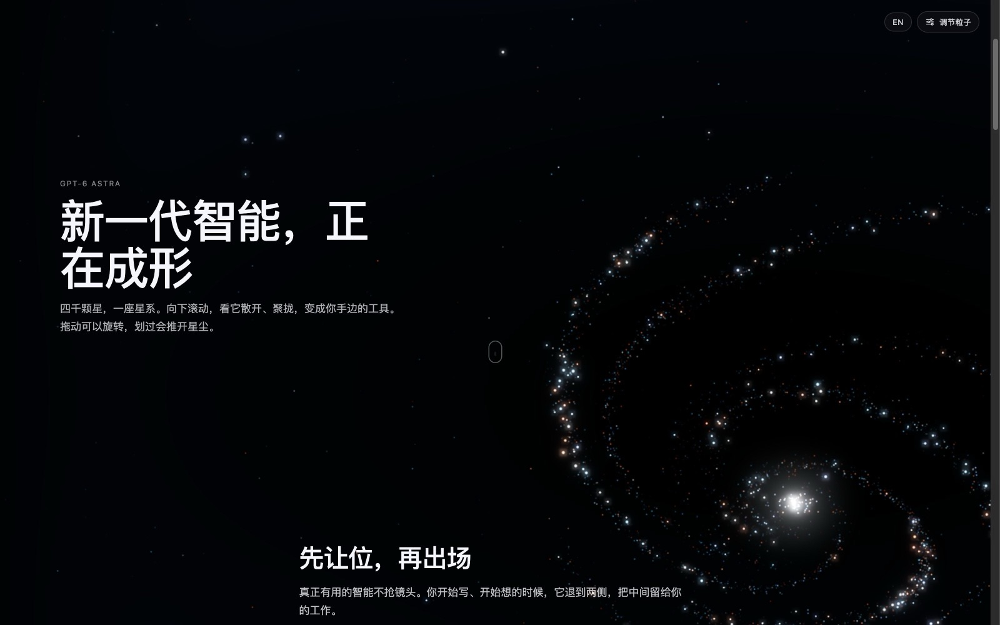
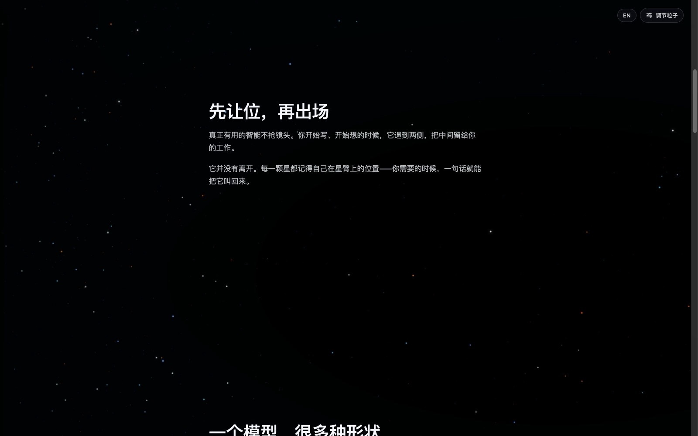
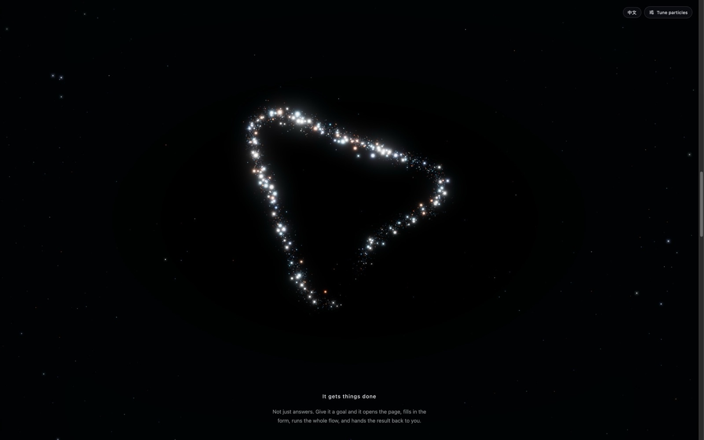
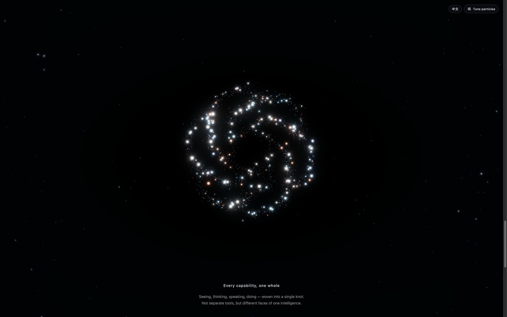
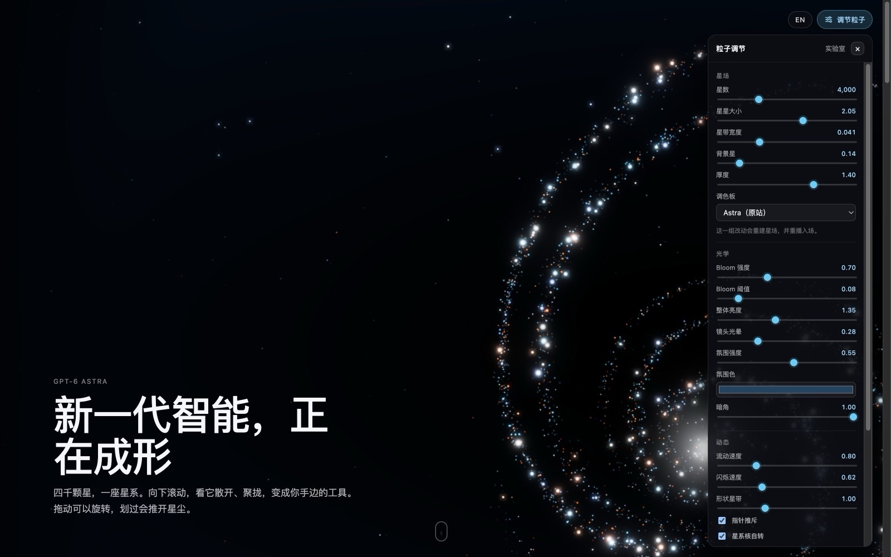
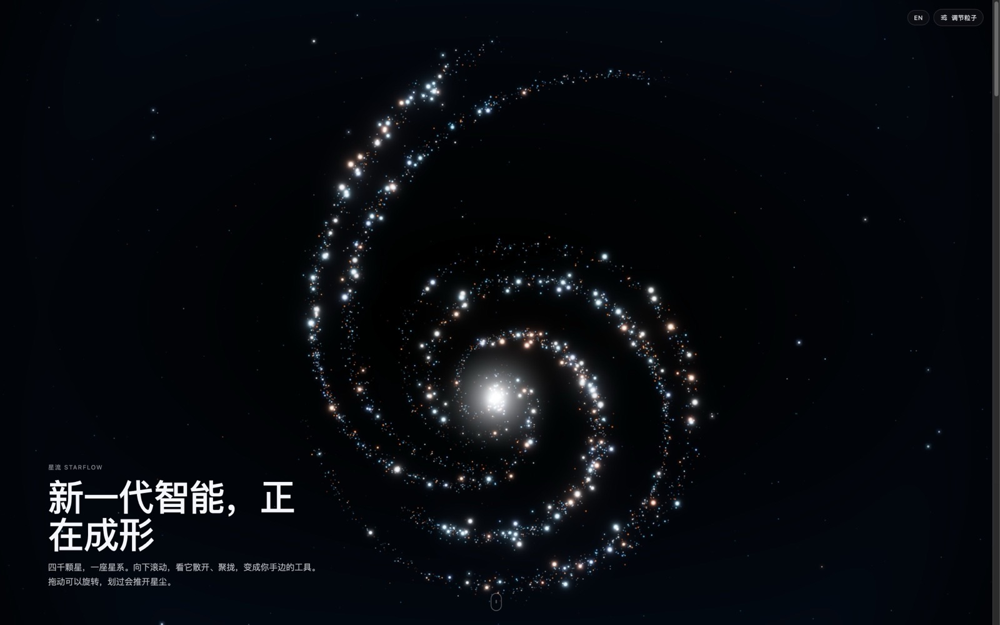
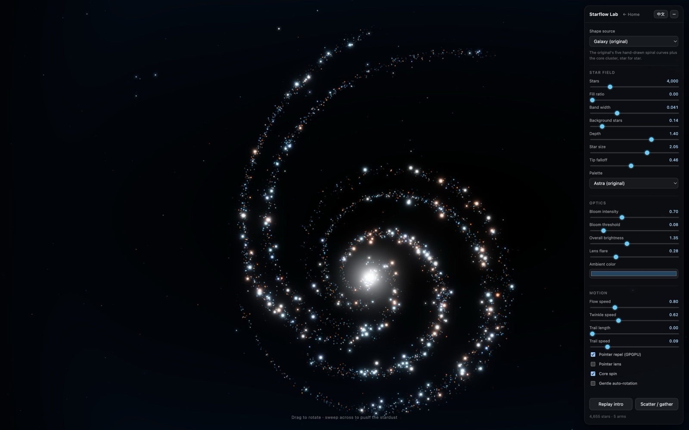

# Starflow

[中文](README.md) · English

A sky that flows: a star-particle system built on three.js + postprocessing. A spiral galaxy tilts as you scroll,
scatters into two rails of stars, then gathers into a cursor and a knot; the same stars can also be arranged into
any text or icon. The particle distribution, flow, bloom, and lens-flare math follow the implementation on
OpenAI's GPT-6 Astra launch page (referred to below as "the original"), extended here with extra shape sources,
adaptive performance, and bilingual copy.



## Quick start

Three ways in, pick the one that matches what you want:

**1. Have a coding agent build a whole page (recommended)**

```bash
# Open Design
od plugin install github:Win-Hao/starflow@main/skill
# Claude Code / Codex / Cursor: copy skill/ into the skills folder
git clone https://github.com/Win-Hao/starflow && cp -r starflow/skill ~/.claude/skills/starflow-launch
```

Then give the agent one sentence, e.g. "Make a launch page for our new model Nova 2 in the Astra style: galaxy hero, three story sections, the stars form a cursor and then our logo, plus a benchmark chart." It copies the engine and hero skeleton, fills in your copy and builds the components from the design system. Details in [Skill and design system](#skill-and-design-system).

**2. Only embed the starfield in your own page**

Copy [`lib/starflow.js`](lib/starflow.js) next to the page (one file, three bundled):

```html
<canvas id="sky"></canvas>
<script type="module">
  import { createAstraScene } from './starflow.js'
  const astra = createAstraScene(document.querySelector('#sky'), { autoRotate: true })
  astra.setSource({ type: 'galaxy' })   // or { type: 'text', text: '6' }, { type: 'paths', … }
</script>
```

No code at all: `<iframe src="embed.html?shape=cursor">`. API in [Use as a library](#use-as-a-library).

**3. Run it locally to see the effect or hack the engine**

```bash
git clone https://github.com/Win-Hao/starflow && cd starflow
npm install
npm run dev      # http://127.0.0.1:5173  home / lab.html / embed.html
                 # http://127.0.0.1:5173/examples/launch-page/  the finished page built with the skill
```

Just want the design spec: drop [`design-systems/openai-astra/DESIGN.md`](design-systems/openai-astra/DESIGN.md) into any project root.

## Pages

| Path | What it is |
|---|---|
| `/` | Home: the scroll choreography of the original landing page. Language switch (中 / EN) and a "Tune particles" panel in the top-right corner |
| `/lab.html` | Lab: arrange the stars into any text, a built-in icon, pasted SVG, or an uploaded image, with every parameter exposed |
| `/embed.html` | Bare effect page for `<iframe>` embedding. `?shape=cursor` / `?shape=openai-knot` / `?text=6` / `?icon=heart` switch the shape |

```bash
npm install
npm run dev      # http://127.0.0.1:5173
npm run build    # all three pages go into dist/
```

## Scroll choreography

The home page reproduces the original's `converge-tilt` preset. All four stages use the same stars.

| Stage | Driven by | Rule |
|---|---|---|
| Tilt | Position of the first copy block below the hero | The galaxy tilts around the X axis to −52°; the tilt peaks at 75% of the progress and flattens back at 100% |
| Star rails | Same block; scattering completes when its midline reaches the viewport midline | 72% of the stars are pushed outside the text column, with the inner edge thinned by a sqrt curve; brightness drops to 18%, dim stars shrink to 45%; depth-dependent parallax while scrolling |
| Cursor | A `[data-astra-shape]` cue element (80vh tall, max width 576px) | Forms while the cue enters the viewport (0–36%), dissolves as it leaves (50–86%); each star lands on the path by its seed, carrying its across-offset and flow speed from the galaxy |
| Knot | The last cue holds at the end | Six arcs each take 1/6 of the total length, so the flow speed scales up by the share; the shape swings 0.42 rad as it forms |

| Tilt | Star rails |
|---|---|
|  |  |

| Cursor | Knot |
|---|---|
|  |  |

The page only measures the DOM and computes progress (`src/home.js`); damping, blending, and flare tracking live in the
engine (`setScroll`):

```js
astra.setScroll({
  progress,          // scrollY / 800
  tiltProgress,      // 0..1, null = follow progress
  scatterProgress,   // 0..1, null = follow progress
  contentBounds,     // { left, right } as viewport fractions; the rails make room for it
  shape: { id, samples, strength, centerNdc, sizeNdc },   // samples come from createShapeSamples()
})
```

### Tuning panel and i18n



The panel has four groups: star field (count, size, band width, background stars, depth, palette — these rebuild the
field), optics (bloom, brightness, lens flare, ambient color, vignette), motion (flow, twinkle, shape band width,
pointer repel, core spin), and performance (post-processing tier, auto-degrade).

Both the home page and the lab ship with Chinese and English copy (`src/i18n.js`); mark an element with
`data-i18n="key"`. The default follows the browser language, and the choice is remembered in `localStorage`.
The screenshots above show the English UI; here is the Chinese one:



## Lab: any text or icon



The original only had hand-drawn curves. The lab adds three shape sources, all of which end up as curves that can be
parameterized by arc length — `orbitProgress`, that one-dimensional parameter, is the foundation of every animation
(flow, tip fade, convergence, flare tracking).

```
Shape sources
  ├─ galaxy        paths.js   the original's 5 curves → THREE.Curve (with z undulation)
  ├─ paths         paths.js   any set of SVG paths, one layer per sub-path (cursor / knot)
  └─ text/svg/img  rasterize.js → contours.js   rasterize → marching squares → resample by arc length
        ↓
field.js      stars along the curves (the original's per-star formulas) + background stars per layer + core cluster
              → BufferGeometry + path texture
shaders.js    vertex: path position → rails → path shape → intro convergence; fragment: disc + diffraction rays
              + analytic sub-pixel coverage
scene.js      orthographic camera + the original's bloom + lens flare + ambient / vignette + ACES; scroll state
              machine; hero tracking
motion.js     GPGPU ping-pong simulation for pointer repulsion
```

```js
import { createAstraScene } from './astra/index.js'

const astra = createAstraScene(document.querySelector('canvas'))
astra.setSource({ type: 'galaxy' })                                              // the galaxy
astra.setSource({ type: 'paths', paths: ['M… C…'], viewBox: [0, 0, 19, 19] })     // a set of SVG paths
astra.setSource({ type: 'text', value: '6', fontWeight: 700 })                   // any text
astra.setSource({ type: 'svg', markup: '<svg viewBox="0 0 24 24">…</svg>' })
astra.setSource({ type: 'image', image: htmlImageElement, useLuminance: true })

astra.setConfig({ flowSpeed: 0, bloomIntensity: 0.9 })
astra.setDisperse(1)   // scatter into the rails; 0 gathers back into the shape
astra.replay()         // replay the intro
astra.dispose()
```

## Key algorithms (following the original)

| Where | What it does |
|---|---|
| `GALAXY_PATHS` / `GALAXY_LAYERS` (paths.js) | Five hand-drawn curves plus per-layer depth / phase / flow speed / strength. Star counts split 220 : 170 between strong and weak layers, independent of arc length |
| Per-star formula (field.js) | Band width = scatter × lerp(0.3, 1, sin πt); bright-star ratio 8.5% on strong layers, 5.5% on weak ones, cut to a fifth near the tips; the RNG seeds match the original, so every star lands in the same place |
| Core cluster (field.js) | 96 stars in an elliptical distribution with radius r^2.4 × 0.42, brighter and whiter toward the center, spinning at 0.36 × flowSpeed rad/s |
| Background stars | An extra 12/88 of each layer stays in the sky; their reveal progress is capped at 0.2, so they stay at 45% size; parented to the unrotated root so the sky doesn't turn when you drag |
| `astraFilteredCore` (shaders.js) | **Analytic coverage** for sub-pixel points (cubic B-spline kernel). Without it, distant 0.5px stars shimmer violently as they move |
| Size envelope / tip fade | `sizeEnvelope = mix(1, 0.14 + 0.86·sin(πt)^0.68, 0.45)`, `tipFade = smoothstep(0, .055, t) × (1 − smoothstep(.945, 1, t))`. Flowing stars vanish at one end and reappear at the other |
| `astraIntroMotion` | Intro convergence. Every star has its own start time and orbit angle, so the shape condenses instead of sliding in as a block |
| `astraCoast` (shaders.js) | Closed-form extrapolation after a repel. Not a single simulation frame runs after you release the mouse |
| Flare follows repel (lensflare.js) | A pushed star's displacement only exists in the GPU state texture, so the hero's texel coordinate and mass are handed to the flare shader, which reads the offset with the same `astraCoast` in its vertex stage |
| Path shapes (shaders.js) | Every sub-path is treated as an open curve; dim stars shrink and half of the bright ones are dimmed to 42%; no primary flare, five heroes spread along the paths carry secondary flares; stars keep their galaxy across-offset and flow speed, so five speed tiers mix on one path |
| `AstraBloomEffect` (bloom.js) | A 2×2 box tap before luminance extraction; the original spends two extra passes on a Gaussian reconstruction, folded here into the composite shader at zero extra passes |
| 5-step palette quantization (palette.js) | 36% cyan / 16% blue / 12% orange / 10% light orange / 26% white. This fixed ratio is where the "cool base with a touch of warmth" comes from |
| Per-layer rotation lag (scene.js) | While dragging, each arm's damping is 14 / (1 + (0.18 + 0.17i) × 0.68 × 2.5): the inner arms follow the hand, the outer ones lag |

### Easy to get wrong

1. **Color pipeline**: stay linear throughout and apply ACES only at the end of post-processing
   (`renderer.toneMapping = NoToneMapping`, `material.toneMapped = false`, `frameBufferType = HalfFloatType`).
   Get the order wrong and bloom clips early, leaving the whole image gray.
2. **Star size is 2.05, not 1**: bright stars need to be around 15px before bloom to get the original's big, soft glow.
3. **The glow comes from a very low threshold** (0.08), not a large radius.
4. **The curves must be open**: closed contours have no endpoints, so no tip fade and no size falloff — the arms turn
   into a uniform necklace.

## Performance

Measured on an Apple M4 (ANGLE/Metal): about 6 ms of GPU time per frame, of which the stars themselves take 0.5 ms;
the rest is post-processing — roughly 2 ms per full-resolution pass, and even small passes carry ~0.15 ms of fixed
overhead. So the strategy is fewer passes, not fewer stars:

- The bloom's Gaussian reconstruction folded from two passes into the composite shader; the lens-flare shader exits
  early for pixels far from any source
- Ambient tint and vignette moved from CSS layers into post-processing: full-screen layers with `mix-blend-mode`
  make the browser compositor redraw the whole screen several times per frame, which accounted for half the dropped
  frames in a 5K window
- The pointer-repel simulation shader is precompiled when the field is built, so the first sweep across the canvas
  no longer stutters
- **Adaptive degradation**: if more than a fifth of the frames in a 1.2 s window are slower than the threshold,
  step down one level. Render cadence first (every 2 / 3 / 4 refresh cycles), then the pixel budget once cadence is
  exhausted. In large windows and on high-refresh displays the bottleneck is usually browser compositing and
  presentation, where lowering resolution doesn't help — even a 300×300 2D canvas changing color every frame only
  reached 48fps in the test setup
- `quality: 'lite' | 'none'` for low-end devices; `pixelBudget` can be set directly

## Parameters

### Shape parameters (second argument of `setSource`; changes rebuild the geometry)

| Parameter | Default (original) | Meaning |
|---|---|---|
| `starCount` | 4000 | Total path stars, split by layer weight |
| `backgroundRatio` | 0.14 | Background stars kept in the sky, relative to the path stars |
| `scatter` | 0.041 | Band half-width relative to the shape height (original: 0.4 / 9.7) |
| `densityFalloff` | 0.22 | Density modulation along the path |
| `rotationDepth` | 1.4 | Z undulation of the curves; depth layering when rotated |
| `flowInward` | true | Flow toward the core; false flows outward |
| `size` | 2.05 | Overall star size |
| `centerCluster` / `clusterCount` | true / 96 | Core cluster (galaxy mode only) |
| `fillRatio` | 0 | Share of dust inside rasterized shapes (text / icons only) |
| `brightRetention` | 1 | Fraction of bright stars kept from being dimmed to 42%. Path-shape presets use 0.5 |
| `palette` | `astra` | `astra` / `aurora` / `ember` / `ice` / `gold` |
| `seed` | 0 | 0 = star-for-star identical to the original |

### Render parameters (`setConfig`; only uniforms change)

| Parameter | Default (original) | Meaning |
|---|---|---|
| `bloomIntensity` / `bloomThreshold` | 0.7 / 0.08 | |
| `intensity` | 1.35 | Overall star brightness |
| `flowSpeed` | 0.8 | Flow speed along the arms; 0 = still |
| `sizeFalloff` | 0.45 | How much stars shrink toward the tips |
| `dimSizeScale` | 1 | Size multiplier for dim stars. Path-shape presets use 0.8 |
| `coreSpin` | true | Core cluster spin |
| `rotationLag` | 0.68 | Per-layer lag while dragging; 0 = rigid rotation |
| `twinkleSpeed` | 0.62 | Twinkle |
| `introDuration` | 5.5 | Intro convergence time in seconds |
| `pointerRepel` | true | GPGPU pointer repulsion, 176px radius |
| `lensMode` | false | Pointer lens magnification |
| `fillX` / `fillY` | 0.8 / 0.89 | Fraction of the viewport the shape occupies (original: 9.7 / 10.9) |
| `center` | `[0, 0]` | Shape offset in half-viewport units |
| `lensFlare` | original defaults | `intensity .28 / halo .12 / streaks .18 / secondary .55 / ghosts .1` |
| `ambientColor` / `ambientOpacity` / `vignette` | `#23435f` / 0.55 / 1 | Ambient tint and vignette |
| `ambientFloor` | 0 | Share of the ambient glow spread evenly over the canvas; 0 = pure radial. The launch-page skeletons leave it at 0 and use `vignette: 0.85`, matched to the page's own CSS layers by measurement |
| `scrollEffects` / `scrollStarDriftSpeed` | true / 3 | Scroll choreography switch and rail parallax speed |
| `shapeAutoRotate` / `shapeScatter` / `shapeBrightRetention` | true / 1 / 0.5 | Path-shape swing, band width, bright-star retention |
| `quality` | `full` | `full` (bloom + flare) / `lite` (bloom only) / `none` (ACES only) |
| `pixelBudget` / `adaptiveQuality` | 2.4e6 / true | Pixel budget and auto-degrade |

## Fallbacks

- **No WebGL** → `renderStaticFallback()` draws the same star data with Canvas 2D, keeping composition and colors
- **`prefers-reduced-motion`** → the timeline freezes (twinkle, flow, spin, repel all stop); shape and bloom remain
- **No `EXT_color_buffer_float`** → GPGPU repulsion turns off; everything else is unaffected

## Not implemented

- Orbital dust: present in the original's code but disabled by default
- Procedural dirty-glass texture: the original generates a smudge map at runtime for UV distortion; only film grain is kept here
- GPU tiers: the original uses detect-gpu with four tiers; this project uses runtime adaptive degradation instead

## Use as a library

The engine works without the three pages. `npm run build:lib` produces three files:

| File | Contents | Use |
|---|---|---|
| `lib/starflow.js` | ES module with three + postprocessing bundled (~640 KB, 162 KB gzip) | Copy next to any page and `import { createAstraScene } from './starflow.js'` in a `<script type="module">` |
| `lib/starflow.iife.js` | Same, exposed as `window.Starflow` | Pages without modules |
| `lib/starflow.slim.js` | No dependencies bundled | `npm i @win-hao/starflow`, then `import { createAstraScene } from '@win-hao/starflow'`; three / postprocessing resolve through npm |

```js
import { createAstraScene, detectWebGL, renderStaticFallback } from './starflow.js'

const canvas = document.querySelector('canvas')
if (detectWebGL()) {
  const astra = createAstraScene(canvas, { autoRotate: true })
  astra.setSource({ type: 'galaxy' })          // or { type: 'paths' | 'text' | 'svg' | 'image', … }
  // Scroll choreography: feed progress every frame, see src/home.js
  // astra.setScroll({ progress, tiltProgress, scatterProgress, contentBounds, shape })
} else {
  renderStaticFallback(canvas, { type: 'galaxy' })
}
```

To have a coding agent build the whole scroll-choreographed page, use the skill in this repository, see the next section.

## Skill and design system

The repository also ships a skill for coding agents and a DESIGN.md design system; all three share one engine:

| Folder | Contents | Use |
|---|---|---|
| [`skill/`](skill/) | `starflow-launch`: SKILL.md, a wired launch-page skeleton, a hero-only page, the single-file engine, reference docs | Open Design: `od plugin install github:Win-Hao/starflow@main/skill`; Claude Code / Cursor: copy `skill/` into the skills folder and ask for "a launch page with starflow" |
| [`design-systems/openai-astra/`](design-systems/openai-astra/) | The dark design system distilled from the public CSS of the GPT-6 Astra launch page (DESIGN.md, tokens.css, component fixture, previews), packaged in the Open Design project shape; submitted as [nexu-io/open-design#7806](https://github.com/nexu-io/open-design/pull/7806) | Drop `DESIGN.md` alone into any project root and agents generate UI in this register |
| [`docs/upstream-prs.md`](docs/upstream-prs.md) | Steps and PR copy for contributing to upstream catalogues | |

### What using the skill looks like

One sentence is enough, for example:

```
Make a launch page for our new model Nova 2 in the Astra style: galaxy hero, three story sections, the stars form a cursor and then our logo, plus a benchmark chart.
```

After reading `SKILL.md` the agent works in three layers:

| Layer | What | Decided by |
|---|---|---|
| Copied verbatim | The engine bundle, the hero skeleton, header / footer geometry, black canvas with white pill controls (the rules forbid rewriting the engine or resizing the hero) | the skill |
| Filled in | Two hero labels, title, lede, 2–4 story sections, one caption per shape, the closing line; the logo's SVG path and palette | the user's brief |
| Built from recipes | Whatever components the page needs: site header, segmented control (6s autoplay linked to charts), chart card, select, download menu, quote carousel, media frame and two-up, comparison table, slide deck, chips / footnotes / logo strip / media bar, footer; sizes, colours and motion come from `DESIGN.md` §4 / §7, working markup from `design-systems/openai-astra/components.html` | the agent, under the rules |

It ends with the step-8 checklist at 1440 / 390 wide. [`examples/launch-page/`](examples/launch-page/) is a page produced this way, in Chinese, with every component above.

`npm run build:lib` writes the engine bundle to both `lib/` and `skill/assets/`; after editing `tokens.css` or DESIGN.md run `scripts/sync-skill.sh` to rebuild the fixture and the copies.


## Project layout

```
index.html / src/home.js / src/home.css   home (scroll choreography + tuning panel + i18n)
lab.html   / src/lab.js  / src/lab.css    lab
embed.html                                embed page
src/i18n.js                               Chinese / English copy
src/presets.js                            path data (cursor, knot) and icon presets
src/lib.js / vite.lib.config.js          library entry and build (lib/starflow*.js)
src/astra/                                engine: scene / field / shaders / paths / bloom / lensflare / ambient / motion / …
docs/screenshots/                         README images
skill/                                    skill for coding agents (SKILL.md, page skeleton, engine bundle)
design-systems/openai-astra/              openai-astra DESIGN.md package
docs/upstream-prs.md                      steps and PR copy for upstream catalogues
scripts/sync-skill.sh                     rebuild the component fixture, sync DESIGN.md copies
examples/launch-page/                     finished Chinese launch page (the demo video page, with auto-scroll recording helpers)
```

The captured reference page and the analysis notes are not part of the repository; every star-related algorithm is
attributed in the source as listed above.

## License

[MIT](LICENSE). The particle effect's algorithms follow OpenAI's GPT-6 Astra launch page; the code is an independent
implementation.
